# styrke-referater: architecture

Drawings in the spirit of the C4 model, as Mermaid `flowchart` diagrams, of `main` as of October 2026. Part 1 shows
how a run decides what is true; part 2 shows the code in C4 levels 1 to 3. Every model name, number, file name and
flag comes from the code, the workflows and scripts in `.github/`, `data/runs.jsonl` or the other docs. The `%%`
comments in each diagram name the constant, function or file the less obvious ones come from: check a figure there,
and update the drawing when it changes.

## Legend

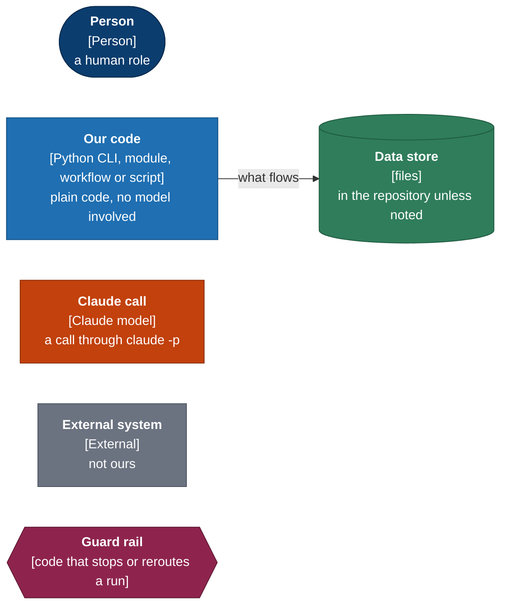

- Each box: **name**, `[type]`, one line on what it does. Dashed frames are boundaries (a workflow, a command, a
  repository). Arrows are labelled with what flows along them.
- Orange boxes are Claude calls; the blue box after one is the code that checks its answer.
- "Effort not set" means the code passes no `--effort`, so Claude Code's own default applies. `styrke/update.py` never
  passes one; the audit does (high), and `uv run -m styrke.evaluate extract` with `--effort`.
- Every Claude call from `styrke/` goes through `claude.ask` in `styrke/claude.py`: `claude -p` with no tools, a system
  prompt and a JSON schema, on the subscription. "USD" means the CLI's list-price estimate, which the caps count.

---

## 1 Methodology: how a run decides what is true

### 1.1 The monthly run, with its side lanes

```mermaid
flowchart TB
  %% Sources. CLI pin and smoke test: .github/actions/claude-cli, its version input's default 2.1.294, used by
  %% update.yml and audit.yml. Rebuild guard: styrke/update.py REBUILD_SHARE 0.10 and REBUILD_CATEGORY_SHARE 0.5,
  %% Work.reasons and Work.migration; its refusal ends with update.HOW_TO_PROCEED and RERUN.
  %% Caps: styrke/update.py DEFAULT_MAX_COST 15 and DEFAULT_TIME_BUDGET 75, update.yml timeout-minutes 120.
  %% Models: update.EXTRACT_MODEL, CONSOLIDATE_MODEL and ASSIGN_MODEL, no options. styrke/update.py --workers default 4,
  %% analyze.EXTRACT_VERSION 3, analyze.EXTRACT_TIMEOUT 600, claude.ask attempts 3 with a 15 s times attempt
  %% pause.
  %% Quote check: analyze.QUOTE_THRESHOLD 0.8. Id carry-over: matching.MATCH_THRESHOLD 0.25.
  %% Meeting date: analyze._meeting_date uses styrke.dk's date when the two years differ by 2 or more.
  %% Migration: update.MIGRATE with MIGRATION_MAX_COST 40 and MIGRATION_TIME_BUDGET 150.
  %% Full consolidation: analyze.CONSOLIDATE_TIMEOUT 1800, 12 categories in analyze.CATEGORIES.
  %% Exit codes: styrke/update.py EXIT_REVIEW 3, EXIT_FAILED 1. Routing: .github/scripts/route-update.sh.
  %% pages.yml triggers: workflow_run after update.yml, push to main on data/**, website/**, styrke/**, pyproject.toml,
  %% uv.lock or the workflow file itself, and workflow_dispatch. styrke/evaluate.py: only extract calls Claude, and not
  %% with --from-data.
  %% Document text: scrape.document_text. An .htm file goes through scrape._decode_html: the byte-order mark,
  %% else the declared charset if the bytes fit it, else UTF-8, else windows-1252. No charset detector is asked.

  styrke["<b>styrke.dk</b><br/>[External website]<br/>index page ?page=referater"]:::ext

  subgraph WF["update.yml [GitHub Actions workflow], 06:00 UTC on the 1st"]
    gcli{{"<b>CLI pin and smoke test</b><br/>[.github/actions/claude-cli, plain code]<br/>Claude Code must be 2.1.294, no ANTHROPIC_API_KEY,<br/>one call to claude-haiku-5-5 must be answered by that model"}}:::guard
    subgraph UPD["uv run -m styrke.update [Python CLI], no options on the monthly cron"]
      scrape["<b>1 Scrape</b><br/>[styrke/scrape.py, plain code]<br/>downloads new or replaced PDF and HTM files,<br/>writes data/manifest.json. Reads their text for step 2:<br/>PDF with page markers, HTM decoded by fixed rules"]:::code
      guard{{"<b>Rebuild guard</b><br/>[update.check_rebuild, plain code, before any Claude call]<br/>stops when over 10 % of the documents need extracting, a category<br/>has decisions but no rule file, over half the categories must be redone,<br/>or a migration is due. The refusal says how to proceed."}}:::guard
      extract["<b>2 Extract</b><br/>[Claude Opus 5.5: claude-opus-5-5, prompt v3]<br/>1 call per new or changed document, effort not set,<br/>up to 4 in parallel, 600 s timeout, up to 3 attempts"]:::claude
      excheck["<b>Code checks on each extraction</b><br/>[styrke/analyze.py, styrke/matching.py]<br/>JSON schema, quote located in the text (80 % of its word triplets),<br/>page corrected, meeting date checked against styrke.dk,<br/>ids carried over by quote position and wording"]:::code
      cons["<b>3 Consolidate, incremental</b><br/>[Claude Sonnet 5.5 votes, Claude Opus 5.5 tie-break and updates]<br/>one document at a time, oldest first: 3 votes per document,<br/>1 update per touched rule (detail in 1.2)"]:::claude
      ccheck["<b>Code checks on each answer</b><br/>[styrke/incremental.py]<br/>a vote counts only for an offered rule, 2 of 3 decide,<br/>earlier versions stay byte-identical, a document is<br/>written only when all its calls pass"]:::code
      checks["<b>4 Checks</b><br/>[styrke/checks.py, plain code]<br/>errors: stale, unassigned, identity<br/>warnings: effect, date"]:::code
      hist{{"<b>History check</b><br/>[checks.check_history, plain code]<br/>year pages before the run against after it: a rule may change<br/>only from the date of its earliest new, changed or removed decision"}}:::guard
      render["<b>5 Render</b><br/>[styrke/render.py, styrke/website.py, plain code]<br/>regelsaet/ and _site/, also when errors were found"]:::code
      report["<b>Run report and exit code</b><br/>[update.write_report, record_run]<br/>run-report.md, usage to data/runs.jsonl<br/>exit 0 no errors, 3 errors, 1 run failed"]:::code
    end
    route{"<b>route-update.sh</b><br/>[Bash]"}:::code
  end

  caps{{"<b>Cost and time caps</b><br/>[claude.RunBudget]<br/>no new call or retry after 15 USD or 75 min,<br/>running calls finish, the job ends at 120 min"}}:::guard
  model{{"<b>Model check</b><br/>[claude.ask]<br/>an answer from another model than the full id asked:<br/>ModelMismatch, the rest of the run is skipped"}}:::guard

  main["<b>main</b><br/>[GitHub repository branch]<br/>commit, an open review PR is closed"]:::ext
  pr["<b>Review pull request</b><br/>[GitHub, branch auto/update]<br/>Monthly update needs review, the run report as body"]:::ext
  pages["<b>pages.yml</b><br/>[GitHub Actions workflow]<br/>also on a push to main touching data/, website/,<br/>styrke/, pyproject.toml, uv.lock or pages.yml,<br/>and on Run workflow.<br/>Runs styrke/checks.py again (an error publishes nothing),<br/>then styrke/website.py, then deploys"]:::code
  ghp["<b>GitHub Pages</b><br/>[External hosting]"]:::ext
  nicki(["<b>Nicki</b><br/>[Person]"]):::person

  subgraph MIG["Side lane: migration, started by hand"]
    mig["<b>Migration run</b><br/>[uv run -m styrke.update --offline --consolidate-mode full --allow-rebuild<br/>--max-cost 40 --time-budget 150]<br/>after a new prompt, model or CONSOLIDATE_VERSION:<br/>extracts every document again, then consolidates in full"]:::code
    full["<b>Full consolidation</b><br/>[Claude Opus 5.5]<br/>1 call per changed category (12 at most), up to 4 in parallel,<br/>effort not set, 1800 s. Code drops unknown refs, lists<br/>refs in no rule as unassigned, carries slugs over."]:::claude
  end
  subgraph AUD["Side lane: audit, started by hand (detail in 1.3)"]
    audit["<b>uv run -m styrke.audit propose, apply</b><br/>[Claude Opus 5.5, effort high]<br/>2 independent runs per category,<br/>only the ops both propose are applied"]:::claude
  end
  subgraph MEAS["Side lane: measurement loop (detail in 1.4)"]
    evalu["<b>styrke/evaluate.py</b><br/>[Python CLI: scoring is plain code,<br/>extract calls Claude]<br/>extraction gate, rule scores, candidate recall"]:::code
  end

  styrke -->|"index page, PDF and HTM files"| scrape
  gcli -->|"CLI checked"| scrape
  scrape -->|"document list"| guard
  guard -->|"an ordinary month's work"| extract
  guard -->|"refused: no Claude call, exit 1"| checks
  extract -->|"decisions as JSON"| excheck
  excheck -->|"data/beslutninger/"| cons
  cons -->|"votes, rewritten versions"| ccheck
  ccheck -->|"data/regler/, data/slugs.json"| checks
  checks -->|"problems"| hist
  hist -->|"errors and warnings"| render
  render -->|"pages written"| report
  report -->|"exit code, first line of the report"| route
  route -->|"0, or 1 when the checks passed"| main
  route -->|"3, 1 without a passing report, or main moved"| pr
  main -->|"update succeeded and changed main"| pages
  pages -->|"_site/"| ghp
  pr -->|"errors, history table"| nicki
  nicki -->|"merge, which triggers pages.yml"| main
  caps -->|"limits every call"| extract
  caps -->|"limits every call"| cons
  model -->|"checks every answer"| extract
  model -->|"checks every answer"| cons
  mig -->|"--allow-rebuild passes the guard"| guard
  excheck -->|"full mode only"| full
  full -->|"regrouped categories"| checks
  main -->|"settled rules"| audit
  audit -->|"PR on auto/audit-DATE"| nicki
  evalu -->|"verdicts in eval/reports/"| nicki
  nicki -->|"new model or prompt"| mig

  style WF fill:none,stroke:#8a8a8a,stroke-dasharray:6 4
  style UPD fill:none,stroke:#8a8a8a,stroke-dasharray:6 4
  style MIG fill:none,stroke:#8a8a8a,stroke-dasharray:6 4
  style AUD fill:none,stroke:#8a8a8a,stroke-dasharray:6 4
  style MEAS fill:none,stroke:#8a8a8a,stroke-dasharray:6 4
  classDef person fill:#0b3d6e,stroke:#072a4d,color:#ffffff
  classDef code fill:#1f6fb2,stroke:#154f80,color:#ffffff
  classDef claude fill:#c2410c,stroke:#8a2e08,color:#ffffff
  classDef ext fill:#6b7280,stroke:#4b5160,color:#ffffff
  classDef store fill:#2f7d5b,stroke:#1f5a40,color:#ffffff
  classDef guard fill:#8e244d,stroke:#5f1833,color:#ffffff
```

Read it top to bottom: Claude does only steps 2 and 3, and code checks every answer before anything is written. The
guard rails decide whether the run may call Claude at all (CLI pin, rebuild guard), how far it may go (caps, model
check), and whether its result may be published (checks, history check, then `styrke/checks.py` once more in
`pages.yml`). Exit code 3 never reaches the website: it goes to a review pull request, and only your merge publishes it.
A run with exit code 1 keeps its partial results on `main` when the checks passed, but the job is marked failed, so
`pages.yml` does not publish it.

The Claude calls at a glance (all from the code; `workers` defaults to 4):

| Step | Model | Effort | Calls | In parallel | Code checks after the answer |
|---|---|---|---|---|---|
| Extract | `claude-opus-5-5`, prompt v3 | not set | 1 per new or changed document | up to 4 | schema, quote located, page, date, id carry-over |
| Assign votes | `claude-sonnet-5-5` | not set | 3 per document (3 more per re-vote) | 3 | only offered rules count, 2 of 3 decide |
| Tie-break | `claude-opus-5-5` | not set | 0 or 1 per round of votes | 1 | the choice must be valid, else the document waits |
| Rule update | `claude-opus-5-5` | not set | 1 per touched or new rule | up to 4 | exact versions, earlier versions byte-identical |
| Full consolidation (migration) | `claude-opus-5-5` | not set | 1 per changed category, 12 at most | up to 4 | known refs once each, unassigned listed |
| Audit propose | `claude-opus-5-5` | high | 2 per category, 24 in all | up to 4 | valid slugs, refs and partitions, both runs agree |
| Audit titles | `claude-opus-5-5` | high | 1 | 1 | the choice must be one of the options |
| Audit rewrite | `claude-opus-5-5` | high | 1 per merged rule and per split part | up to 4 | only the text fields change |

Measured (`data/runs.jsonl`): the migration made 236 extraction calls for 16.74 USD and 12 consolidation calls for
8.58; the plain run after it made 4 calls for 0.11; the first audit made 24 propose calls, 1 title call and 17
rewrite calls.

### 1.2 Inside step 3: consolidation

```mermaid
flowchart TB
  %% Sources. styrke/incremental.py: VOTES 3, ASSIGN_TIMEOUT 600, UPDATE_TIMEOUT 1200, PASSAGE_BEFORE 100,
  %% PASSAGE_AFTER 400, HISTORY_SHOWN 6, Settings assign_model and update_model: update.ASSIGN_MODEL
  %% claude-sonnet-5-5 and CONSOLIDATE_MODEL claude-opus-5-5. Votes and tie-break pass effort None, the update
  %% Settings.update_effort, which styrke/update.py leaves None.
  %% styrke/candidates.py: CANDIDATE_K 15, CATEGORY_BOOST 0.3. Misfiled loop: incremental.process_document.
  %% Full mode: analyze.consolidate and analyze._rules_from, analyze.CONSOLIDATE_TIMEOUT 1800.

  besl[("<b>data/beslutninger/</b><br/>[JSON, one file per document]<br/>the extracted decisions")]:::store
  queue["<b>Work queue</b><br/>[incremental.work_queue, plain code]<br/>decisions the rule files do not reflect yet (new, changed, retired),<br/>known by fingerprint, documents oldest first,<br/>no new document once a cap is reached"]:::code

  subgraph DOC["Per document, one at a time"]
    cand["<b>Candidates</b><br/>[styrke/candidates.py, plain code]<br/>TF-IDF over Danish stems and compound parts:<br/>the 15 closest live rules per new decision,<br/>its own category boosted by a factor 1.3"]:::code
    vote["<b>Assign: 3 votes</b><br/>[Claude Sonnet 5.5: claude-sonnet-5-5]<br/>3 calls in parallel, effort not set, 600 s,<br/>each vote reads the candidates in another order"]:::claude
    tally["<b>Tally</b><br/>[incremental.read_vote, tally]<br/>a choice outside the decision's own candidates is no vote,<br/>2 of 3 decide, a new rule named like a live rule goes to the tie-break"]:::code
    tie["<b>Tie-break</b><br/>[Claude Opus 5.5: claude-opus-5-5]<br/>1 call with the same prompt, blind to the votes,<br/>effort not set"]:::claude
    plan["<b>Plan the updates</b><br/>[incremental.plan_update, passages]<br/>the insertion point of each touched rule, and the minutes from<br/>100 words before each new quote to 400 after it or its vote count"]:::code
    upd["<b>Update rules</b><br/>[Claude Opus 5.5]<br/>1 call per touched or new rule, up to 4 in parallel,<br/>effort not set, 1200 s"]:::claude
    merge["<b>Merge check</b><br/>[incremental.merge]<br/>exactly the versions asked for, the versions before the insertion<br/>point byte-identical, a proposal's effect follows its outcome,<br/>a rejected answer is asked once more"]:::code
    misf{"<b>Misfiled?</b><br/>[the update call says a new decision<br/>is not about its rule]"}:::code
    write["<b>Write the document</b><br/>[incremental._apply]<br/>only when every call of the document passed: slugs.json first,<br/>then the rule files. Otherwise nothing, and the next run tries again."]:::code
  end

  settle["<b>Settle</b><br/>[incremental.settle, analyze.resolve_slugs]<br/>input_hash of each category that reflects all its decisions,<br/>every former slug led to the rule holding its decisions"]:::code
  regler[("<b>data/regler/, data/slugs.json</b><br/>[JSON]<br/>rule histories, former slugs")]:::store

  subgraph FULL["Full mode instead: --consolidate-mode full, the migration"]
    fcall["<b>Consolidate a category</b><br/>[Claude Opus 5.5]<br/>1 call per category whose input changed (12 at most),<br/>up to 4 in parallel, effort not set, 1800 s"]:::claude
    fcheck["<b>Code checks</b><br/>[analyze._rules_from, matching.carry_slugs]<br/>unknown refs dropped, each ref once, a proposal's effect follows its outcome,<br/>refs in no rule listed as unassigned (a check error),<br/>slugs follow the decisions they share"]:::code
  end

  besl -->|"decisions"| queue
  queue -->|"next document: its new, changed and retired decisions"| cand
  cand -->|"15 candidates each, with their latest 6 decisions"| vote
  vote -->|"3 answers"| tally
  tally -->|"no majority, or a namesake"| tie
  tally -->|"a rule, new with a title, or one-off"| plan
  tie -->|"a valid choice, else the document waits"| plan
  plan -->|"rule history and passages of the minutes"| upd
  upd -->|"versions from the insertion point, vigtig, note, misfiled"| merge
  merge -->|"accepted versions"| misf
  misf -->|"once: vote again without that rule"| vote
  misf -->|"twice: a new rule, listed in the run report"| write
  misf -->|"no"| write
  write -->|"changed rule files"| regler
  write -->|"next document"| queue
  queue -->|"queue empty"| settle
  settle -->|"input_hash, slug history"| regler
  besl -->|"a category's decisions"| fcall
  fcall -->|"rules and one-offs"| fcheck
  fcheck -->|"the whole category file"| regler

  style DOC fill:none,stroke:#8a8a8a,stroke-dasharray:6 4
  style FULL fill:none,stroke:#8a8a8a,stroke-dasharray:6 4
  classDef person fill:#0b3d6e,stroke:#072a4d,color:#ffffff
  classDef code fill:#1f6fb2,stroke:#154f80,color:#ffffff
  classDef claude fill:#c2410c,stroke:#8a2e08,color:#ffffff
  classDef ext fill:#6b7280,stroke:#4b5160,color:#ffffff
  classDef store fill:#2f7d5b,stroke:#1f5a40,color:#ffffff
  classDef guard fill:#8e244d,stroke:#5f1833,color:#ffffff
```

Code decides which rules Claude may choose from (the 15 candidates), Sonnet votes three times, and Opus only breaks
ties and writes rule texts, one rule per call. It never rewrites what lies before the new decision: `merge` checks
that byte for byte. A document is all or nothing, so a failed call leaves no half-filed document behind. Full mode,
used for a migration, hands Opus a whole category at once and regroups it from scratch.

### 1.3 Side lane: the audit

```mermaid
flowchart TB
  %% Sources. styrke/audit.py: MODEL claude-opus-5-5, EFFORT high, RUNS 2, SIMILARITY 0.1, PROPOSE_TIMEOUT 1800,
  %% TITLE_TIMEOUT 600, TEXT_TIMEOUT from incremental.UPDATE_TIMEOUT 1200, DEFAULT_TIME_BUDGET 75, --workers default 4.
  %% 24 calls: 12 categories times 2 runs, measured in data/runs.jsonl. --max-cost is required by styrke/audit.py.
  %% audit.yml: max_cost default 25, TIME_BUDGET 75, step timeout 110, job timeout 120.
  %% route-audit.sh check: month end within 2 days, other auto/audit-* branches.

  nicki(["<b>Nicki</b><br/>[Person]"]):::person
  pre{{"<b>Before any call</b><br/>[audit.yml, route-audit.sh check, .github/actions/claude-cli]<br/>no update.yml run active or queued, no other auto/audit-* branch,<br/>not in a month's last 2 days, CLI pin and smoke test"}}:::guard
  caps{{"<b>Caps</b><br/>[claude.RunBudget, audit.plan_calls]<br/>cost estimate printed first, --max-cost per command (workflow: 25 USD),<br/>75 min for propose and apply together, step 110 min, job 120 min"}}:::guard
  regler[("<b>data/regler/, data/slugs.json</b><br/>[JSON]<br/>the rules as the monthly runs left them")]:::store

  subgraph PROP["uv run -m styrke.audit propose"]
    unset{{"<b>Settled?</b><br/>[audit.unsettled]<br/>nothing for styrke/update.py to file, no category to consolidate,<br/>no check error, else it stops"}}:::guard
    sim["<b>Similar rules</b><br/>[styrke/candidates.py via incremental, plain code]<br/>rule against rule, in any category:<br/>cosine similarity of at least 0.1"]:::code
    prop["<b>Propose ops</b><br/>[Claude Opus 5.5: claude-opus-5-5, effort high]<br/>2 independent runs × 12 categories = 24 calls, the rules<br/>in another order per run, up to 4 in parallel, 1800 s"]:::claude
    val["<b>Validate</b><br/>[audit.validate, conflicts]<br/>rejects unknown slugs, refs or categories, ops citing no decision,<br/>splits whose parts do not divide the rule exactly,<br/>two ops of one run on one rule (a rename with a move excepted)"]:::code
    agree["<b>Agree</b><br/>[audit.agree, plain code]<br/>an op stands only when both runs propose it:<br/>the same rules, partition or category"]:::code
    title["<b>Choose titles</b><br/>[Claude Opus 5.5, effort high]<br/>1 call, for every rename and where the runs' titles differ"]:::claude
    tcheck["<b>Title check</b><br/>[audit.chosen_titles]<br/>a choice outside the options keeps the current title"]:::code
  end

  cache[("<b>data/audit/</b><br/>[JSON, one file per call]<br/>every answer with a fingerprint of the question,<br/>so a repeated command never pays twice")]:::store
  regops[("<b>data/regler_ops.json</b><br/>[JSON]<br/>every op, its proposals and reasons,<br/>agreed or not, rejected answers")]:::store

  subgraph APP["uv run -m styrke.audit apply"]
    same{{"<b>Same data?</b><br/>[audit.data_fingerprint, check_ops]<br/>stops when the rules or slugs changed since propose"}}:::guard
    rest["<b>Restructure</b><br/>[audit.restructure, plain code]<br/>merge: the rule with most versions keeps its slug, the others become aliases<br/>split: the largest part keeps the slug, then move and rename"]:::code
    rew["<b>Rewrite texts</b><br/>[Claude Opus 5.5, effort high]<br/>1 call per merged rule and per split part,<br/>up to 4 in parallel, 1200 s"]:::claude
    rcheck["<b>Rewrite check</b><br/>[audit.rewritten]<br/>the same decisions in the same order, only effekt, tekst,<br/>kort and kort_regel may change, a rejected answer is asked once more"]:::code
    ver{{"<b>Verify in a copy</b><br/>[audit.checked, verify]<br/>no check error, nothing left for styrke/update.py,<br/>every old slug still leads to a rule, else nothing is written"}}:::guard
    score["<b>Answer-key score</b><br/>[evaluate.score_section, plain code]<br/>before and after, with a gate line in the report<br/>(reported, not enforced)"]:::code
  end

  route["<b>route-audit.sh route</b><br/>[Bash]<br/>always a PR on auto/audit-DATE. When cut off it is titled unfinished:<br/>rules and pages are reset, the paid answers kept."]:::code

  nicki -->|"Run workflow: categories, max cost"| pre
  pre -->|"may start"| unset
  regler -->|"rules and decisions"| unset
  unset -->|"settled data"| sim
  sim -->|"a category's rules in full, similar rules of others in brief"| prop
  prop -->|"each answer"| cache
  prop -->|"ops with reasons and cited decisions"| val
  val -->|"accepted ops"| agree
  agree -->|"agreed ops whose titles must be chosen"| title
  title -->|"chosen titles"| tcheck
  tcheck -->|"agreed ops with titles"| regops
  regops -->|"a complete ops file"| same
  same -->|"agreed ops"| rest
  rest -->|"merged and split rules, every version to rewrite"| rew
  rew -->|"rewritten histories"| rcheck
  rcheck -->|"the restructured rules"| ver
  ver -->|"slugs first, then rule files, ops file, pages"| regler
  ver -->|"checked result"| score
  score -->|"audit-report.md"| route
  route -->|"pull request to review"| nicki
  caps -->|"limits every call"| prop
  caps -->|"limits every call"| rew

  style PROP fill:none,stroke:#8a8a8a,stroke-dasharray:6 4
  style APP fill:none,stroke:#8a8a8a,stroke-dasharray:6 4
  classDef person fill:#0b3d6e,stroke:#072a4d,color:#ffffff
  classDef code fill:#1f6fb2,stroke:#154f80,color:#ffffff
  classDef claude fill:#c2410c,stroke:#8a2e08,color:#ffffff
  classDef ext fill:#6b7280,stroke:#4b5160,color:#ffffff
  classDef store fill:#2f7d5b,stroke:#1f5a40,color:#ffffff
  classDef guard fill:#8e244d,stroke:#5f1833,color:#ffffff
```

The audit fixes what incremental consolidation cannot: rules that should be merged, split, renamed or moved. Two Opus
runs propose ops independently, and an op only stands when both propose it. Code, not Claude, then changes the
structure, and Opus only rewrites the texts of the rules it merged or split. Nothing reaches `main` without a pull
request: an audit changes earlier years on purpose, so its report shows what each year shows before and after. The
first audit applied 16 agreed ops (8 merges, 4 splits, 4 moves) for 14.11 USD.

### 1.4 Side lane: the measurement loop

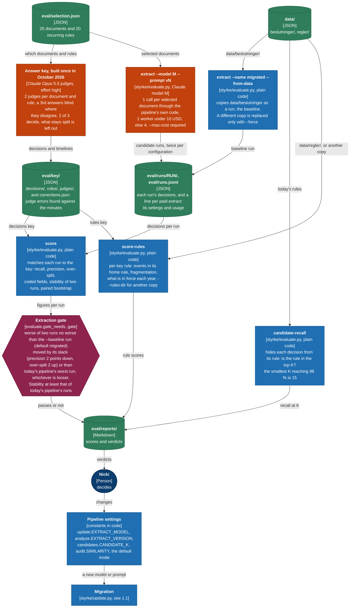

Two extraction runs agree on only about 90 % of decisions, so the pipeline's choices are measured against an answer
key that Opus judged once, not against each other. The gates only report: a person changes a constant, and a new
model or prompt then reaches `data/` through a migration. This loop chose Opus with prompt v3 (recall 91.7 % against
the stored Sonnet run's 79.8 %), 15 candidates, incremental mode as the default, and the audit's threshold of 0.1;
the replays and the threshold calibration behind the last two were retired once decided; their code is in commit
9f39874. Since the migration the gate measures against today's data, `migrated`: Opus with v3 passes as the
reference, Sonnet with v2 or v3 fails (`eval/reports/decisions-gate.md`).

---

## 2 Code architecture

### 2.1 Level 1: Context

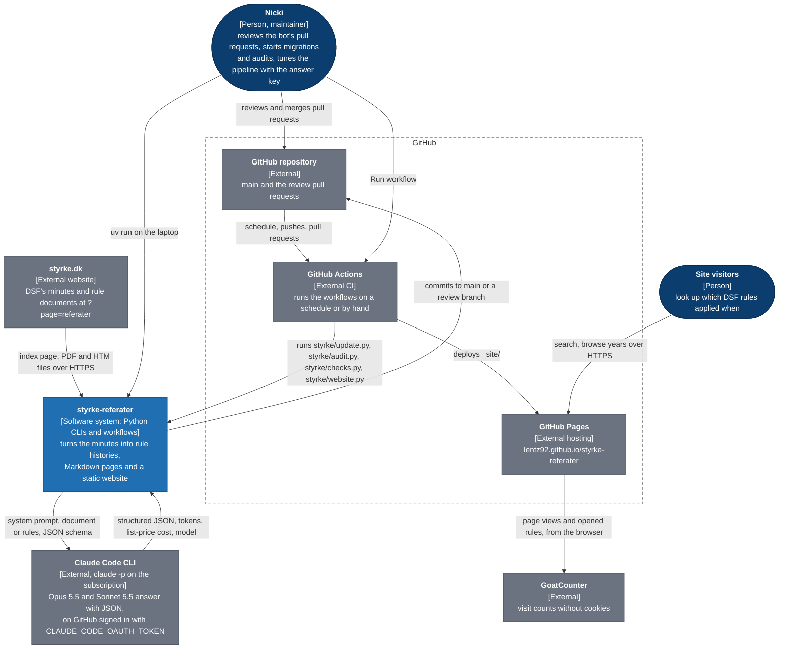

The system has one source (styrke.dk) and one model provider (the Claude Code CLI on your subscription, never an API
key). GitHub does everything else: it runs the code, holds the data in the repository and serves the website. You
touch the system through pull requests and "Run workflow", or by running the CLIs locally.

### 2.2 Level 2: Containers, monthly pipeline and publishing

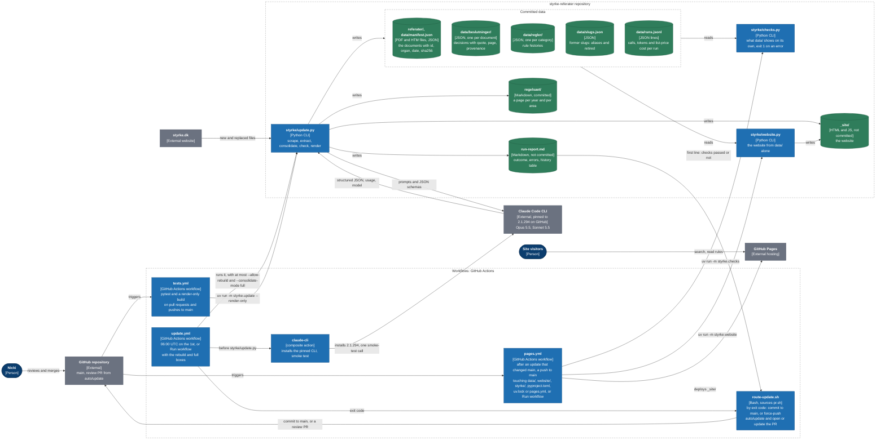

`styrke/update.py` is the only container that asks Claude for answers in the monthly path (the action's smoke test only
checks the CLI), and it writes every data store. The website is never published from the update job itself:
`pages.yml` rebuilds `_site/` from committed `data/` with `styrke/website.py`, and only after `styrke/checks.py` passes.
`regelsaet/` is committed, so its diff in a pull request shows the changed rules as text.

### 2.3 Level 2: Containers, audit and measurement

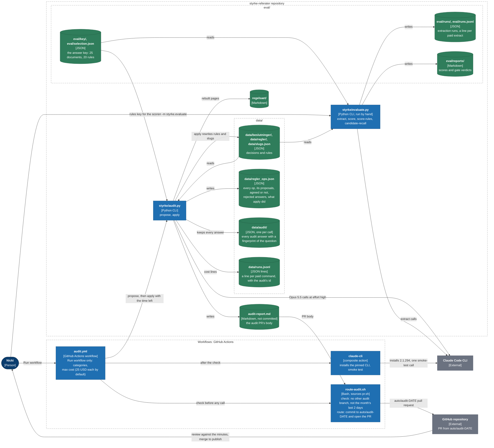

`styrke/audit.py` writes into `data/` like a monthly run, but only through a pull request; `styrke/evaluate.py` writes
only under `eval/` and never touches `data/` or `regelsaet/`. The answer key in `eval/key/` has no writer today: the
commands that built it were removed. `data/runs.jsonl` is appended by both the update and audit workflows, and git
merges it by keeping both sides' lines (`.gitattributes`).

### 2.4 Level 3: Components of the monthly run

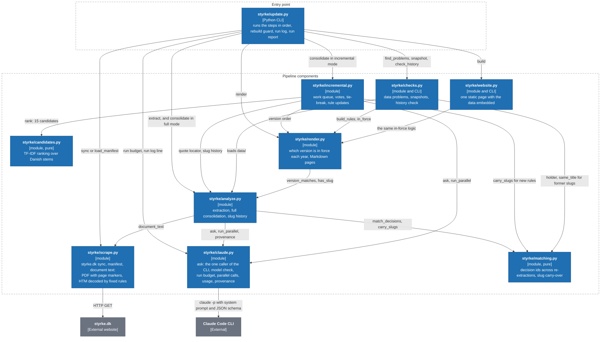

`styrke/claude.py` alone runs `claude -p`: the other modules reach Claude only through its `ask`, and it keeps the
run's cost and time limits and what each call used. `styrke/analyze.py` is the hub for the data: it loads and writes
the decisions, rules and slug history the others build on. `styrke/candidates.py` and `styrke/matching.py` are pure
functions, which keeps the ranking and the id rules testable without Claude. `styrke/checks.py` and `styrke/website.py`
work out what is in force through `styrke/render.py`, so the checks, the Markdown pages and the website always agree.
Imports of shared constants (for example `analyze.CATEGORIES` in `styrke/render.py`) are left out, and so is what the
`styrke/checks.py` and `styrke/website.py` CLIs load on their own (`scrape.load_manifest`, and in `styrke/website.py`
the `analyze` loaders).

### 2.5 Level 3: How audit.py and evaluate.py reuse the components

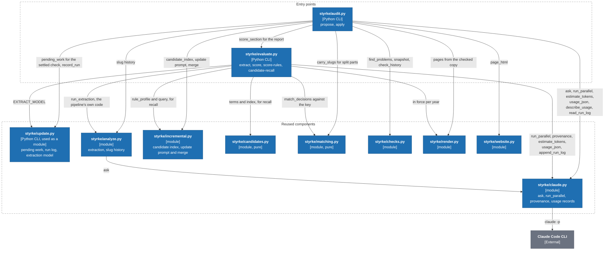

Neither tool has its own Claude or matching logic: both call Claude and record what it used through
`styrke/claude.py`, the audit reuses incremental consolidation's prompt and merge check for its rewrites, and the
evaluation runs the pipeline's own extraction code and candidate ranking, so what it measures is what the pipeline does.
`styrke/audit.py` also depends on `styrke/evaluate.py` for its answer-key score and on `styrke/update.py` to refuse an
audit while a monthly run has work left.

### 2.6 Level 3: Which module owns which file

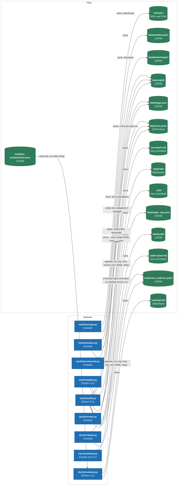

`data/regler/` has three writers: a full consolidation (`styrke/analyze.py`), an incremental one
(`styrke/incremental.py`) and an audit's apply (`styrke/audit.py`). All three write the slug history first, so a slug is
never lost if a later write fails. `styrke/render.py` and `styrke/website.py` write only derived output, which any run
can rebuild from `data/` (`uv run -m styrke.update --render-only`). `styrke/candidates.py`, `styrke/matching.py` and
`styrke/checks.py` write no files; `styrke/claude.py` only appends a line to the run log its caller names: the time, the
caller's fields, then each step's usage.

---

## Notes

- The gates in 1.4 and the audit's answer-key gate only report a verdict. A person acts on it; no code reads it.
- Effort: only the audit (`audit.EFFORT = "high"`), the answer-key judges (effort `high` in their recorded provenance)
  and `uv run -m styrke.evaluate extract --effort` set one. The monthly run and the migration use Claude Code's default,
  which the code does not record beyond `"default"`.
